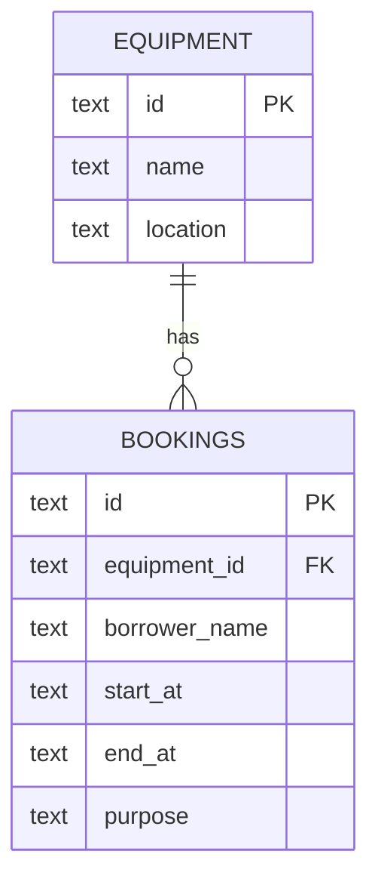

# Schema / ERD

`bookings.equipment_id` references `equipment.id`, and foreign keys are enabled. Date-times are stored as ISO-8601 text, which sorts chronologically when consistently formatted. SQL values from requests use `?` parameter binding.